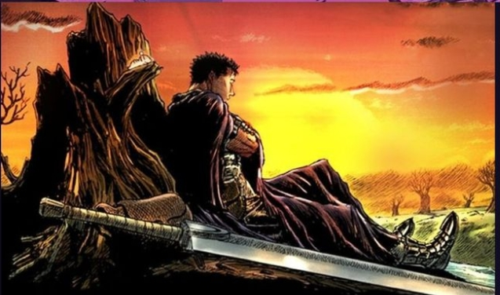

I am a student of Computer Engineering at UNAM, Faculty of Engineering UwU

##                                   😄About me😄

- 🤓I'm a programmer in the making owo
- 🤪I often have very crazy ideas.
- 🎮I like video games and I hope to work on one later
- 🤖I'm an average otaku but I want to program great things

  

_______________________________________________________________________________
##                        👾Urrent Technologies I'm Learning🤖

  

________________________________________________________________________________
##                                 🌟Some Statistics🌟

    

    

--------------------------------------------------------------------------------
##                     ✨Thanks for stopping by my profile🌟

  
    

